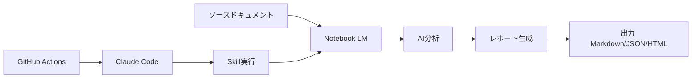

# プロジェクト概要

## Notebook LM Report Automation System

Claude Code SkillsとGitHub Actionsを使用して、Notebook LMによるレポート作成を自動化するシステムです。

## 📂 プロジェクト構造

```
muchinochi-notebook-LM/
├── .claude/
│   ├── skills/
│   │   ├── generate-notebooklm-report.md     # Claude Skill定義
│   │   └── scripts/
│   │       └── notebooklm_reporter.py        # レポート生成メインスクリプト
│   └── settings.local.json                   # Claude Code ローカル設定
│
├── .github/
│   └── workflows/
│       └── generate-report.yml               # GitHub Actionsワークフロー
│
├── docs/
│   └── NOTEBOOKLM_INTEGRATION.md            # Notebook LM統合ガイド
│
├── sources/
│   ├── .gitkeep
│   └── sample-document.md                    # サンプルソースドキュメント
│
├── reports/
│   └── .gitkeep                              # 生成されたレポートの出力先
│
├── .gitignore                                # Git除外設定
├── LICENSE                                   # MITライセンス
├── README.md                                 # メインドキュメント
├── SETUP_GUIDE.md                            # 詳細セットアップガイド
├── requirements.txt                          # Python依存関係
└── PROJECT_OVERVIEW.md                       # このファイル
```

## 🎯 主な機能

### 1. Claude Code Skill
- `/generate-notebooklm-report` コマンドでレポート生成
- カスタマイズ可能なパラメータ（ソースディレクトリ、フォーマット等）
- Python スクリプトで実装された柔軟な処理

### 2. GitHub Actions 統合
- **手動トリガー**: ワークフローディスパッチで任意のタイミングで実行
- **自動トリガー**:
  - PRの作成時（sources/ または docs/ の変更時）
  - 定期実行（毎週月曜日）
- **アーティファクト**: 生成されたレポートを自動保存

### 3. Notebook LM API 統合
- Notebook LM Enterprise API対応
- サードパーティAPI（Apify）対応
- 既存ノートブックの利用も可能

## 🚀 クイックスタート

### 前提条件
- Claude Code (Pro/Max)
- Google Cloud アカウント（Enterprise API使用時）
- GitHub リポジトリ

### 基本セットアップ（3ステップ）

```bash
# 1. リポジトリをクローン
git clone https://github.com/d71280/muchinochi-notebook-LM.git
cd muchinochi-notebook-LM

# 2. Claude Code OAuth トークンを設定
claude /install-github-app

# 3. Notebook LM API 認証情報を GitHub Secrets に追加
# （詳細は SETUP_GUIDE.md 参照）
```

## 📖 ドキュメント

| ファイル | 内容 |
|---------|------|
| [README.md](./README.md) | プロジェクト概要と基本的な使い方 |
| [SETUP_GUIDE.md](./SETUP_GUIDE.md) | 詳細なセットアップ手順とトラブルシューティング |
| [docs/NOTEBOOKLM_INTEGRATION.md](./docs/NOTEBOOKLM_INTEGRATION.md) | Notebook LM統合方法と既存ノートブックの利用 |

## 🔧 カスタマイズポイント

### 1. ワークフロートリガーの変更
`.github/workflows/generate-report.yml` の `on:` セクションを編集

### 2. レポートフォーマットの拡張
`.claude/skills/scripts/notebooklm_reporter.py` の `generate_report()` メソッドを編集

### 3. Claude Skill のパラメータ追加
`.claude/skills/generate-notebooklm-report.md` を編集

## 🔐 必要な GitHub Secrets

| Secret名 | 説明 | 必須 |
|---------|------|------|
| `CLAUDE_CODE_OAUTH_TOKEN` | Claude Code認証トークン | ✅ |
| `NOTEBOOKLM_PROJECT_ID` | Google Cloud プロジェクトID | ✅ (Enterprise使用時) |
| `NOTEBOOKLM_LOCATION` | APIロケーション（例: us-central1） | オプション |
| `GOOGLE_APPLICATION_CREDENTIALS_JSON` | サービスアカウントキー | ✅ (Enterprise使用時) |
| `NOTEBOOKLM_API_KEY` | サードパーティAPIキー | ✅ (Apify等使用時) |

## 💡 使用例

### ローカルでの実行

```bash
# Python環境のセットアップ
pip install -r requirements.txt

# レポート生成
python .claude/skills/scripts/notebooklm_reporter.py \
  --source-dir ./sources \
  --format markdown \
  --notebook-name "週次レポート"
```

### Claude Code での実行

```bash
claude
```

Claude Code内で：
```
/generate-notebooklm-report --source-dir ./sources --format markdown
```

### GitHub Actions での実行

1. GitHubリポジトリの「Actions」タブ
2. 「Generate Notebook LM Report」を選択
3. 「Run workflow」をクリック
4. パラメータを入力して実行

## 🔄 ワークフロー



## 📊 ユースケース

### 1. 週次レポート
- 毎週月曜日に自動実行
- 前週の活動ログを分析
- サマリーレポートを生成

### 2. PR レビュー支援
- PR作成時に自動実行
- 関連ドキュメントを分析
- 影響分析レポートを生成

### 3. ドキュメント統合
- 複数のドキュメントを統合
- クロスリファレンス生成
- ナレッジベース構築

## 🤝 2つのアプローチ

### アプローチ A: ローカル対話型（notebooklm-skill）

[PleasePrompto/notebooklm-skill](https://github.com/PleasePrompto/notebooklm-skill) を使用

```bash
cd ~/.claude/skills
git clone https://github.com/PleasePrompto/notebooklm-skill notebooklm
```

**メリット**:
- 対話的な分析が可能
- リアルタイムで質問できる
- 既存ノートブックを簡単に利用

### アプローチ B: GitHub Actions 自動化（このリポジトリ）

**メリット**:
- 完全自動化
- CI/CDパイプライン統合
- スケジュール実行
- チーム共有が容易

### ハイブリッド利用

両方を組み合わせて使用することも可能：
- ローカルで対話的に分析
- GitHub Actionsで定期レポート生成
- 同じNotebook IDを共有

詳細は [docs/NOTEBOOKLM_INTEGRATION.md](./docs/NOTEBOOKLM_INTEGRATION.md) を参照。

## 🛠️ 技術スタック

- **Language**: Python 3.11+
- **AI Platform**: Claude Code (Anthropic)
- **CI/CD**: GitHub Actions
- **API**: Notebook LM Enterprise / Third-party APIs
- **Cloud**: Google Cloud Platform

## 📝 ライセンス

MIT License - 詳細は [LICENSE](./LICENSE) を参照

## 🆘 サポート

問題や質問がある場合：
- [Issues](https://github.com/d71280/muchinochi-notebook-LM/issues) で報告
- [SETUP_GUIDE.md](./SETUP_GUIDE.md) のトラブルシューティングを参照

## 🎉 次のステップ

1. ✅ セットアップ完了後、サンプルレポートを生成してテスト
2. ✅ 実際のドキュメントを `sources/` に追加
3. ✅ ワークフローのトリガー条件をカスタマイズ
4. ✅ チームメンバーと共有

---

**Powered by Claude Code + Notebook LM** 🤖📚
