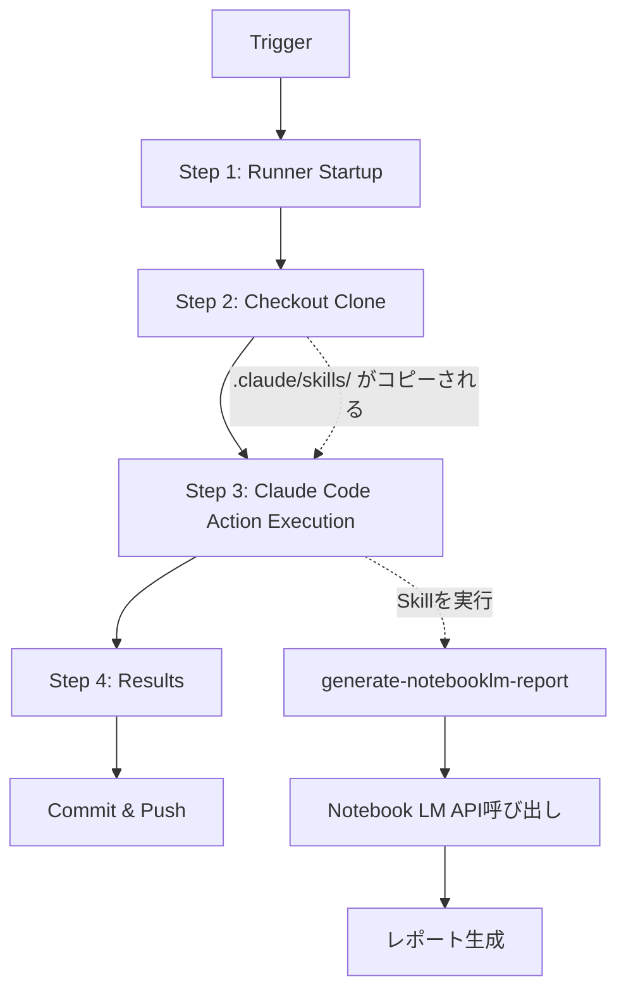

# Notebook LM Report Automation with Claude Code

このリポジトリは、Claude Code SkillsとGitHub Actionsを使用して、Notebook LMによるレポート作成を自動化するシステムです。

## 🌟 特徴

- **自動レポート生成**: ソースドキュメントからNotebook LMを使用して自動的にレポートを生成
- **毎日の振り返り自動化**: 毎朝6時に前日の活動を自動分析してGoogle Chatに通知
- **GitHub Actions統合**: プルリクエストや定期実行でレポートを自動生成
- **Claude Code Skills**: カスタムスキルでNotebook LM APIを操作
- **Google Chat通知**: 生成されたレポートを自動的にGoogle Chatに配信
- **複数フォーマット対応**: Markdown、JSON、HTML形式でのエクスポート
- **CI/CD統合**: 開発ワークフローにシームレスに統合

## 📁 プロジェクト構造

```
.
├── .claude/
│   └── skills/
│       ├── generate-notebooklm-report.md    # Claude Skill定義
│       └── scripts/
│           └── notebooklm_reporter.py       # レポート生成スクリプト
├── .github/
│   └── workflows/
│       ├── generate-report.yml              # レポート生成ワークフロー
│       └── daily-reflection.yml             # 毎日の振り返りワークフロー
├── sources/                                 # ソースドキュメントを配置
├── reports/                                 # 生成されたレポートの出力先
└── README.md
```

## 🚀 セットアップ

### 1. リポジトリのクローンまたはテンプレート使用

```bash
git clone https://github.com/yourusername/muchinochi-notebook-LM.git
cd muchinochi-notebook-LM
```

### 2. Claude Code OAuth トークンの設定

GitHub Appをインストールしてトークンを取得：

```bash
claude /install-github-app
```

これにより、`CLAUDE_CODE_OAUTH_TOKEN` シークレットが自動的にリポジトリに設定されます。

### 3. Notebook LM API認証情報の設定

#### Notebook LM Enterprise を使用する場合:

1. Google Cloud Consoleでプロジェクトを作成
2. Notebook LM Enterprise APIを有効化
3. サービスアカウントを作成してJSONキーをダウンロード
4. GitHub リポジトリのSecretsに以下を設定:

```
NOTEBOOKLM_PROJECT_ID: your-gcp-project-id
NOTEBOOKLM_LOCATION: us-central1
GOOGLE_APPLICATION_CREDENTIALS_JSON: <サービスアカウントキーのJSON内容>
```

#### サードパーティAPI（Apify等）を使用する場合:

```
NOTEBOOKLM_API_KEY: your-api-key
```

### 4. Google Chat Webhook の設定

毎日の振り返りをGoogle Chatに通知するには：

1. Google Chatのスペースを開く
2. スペース名の横の▼をクリック → 「アプリとインテグレーションを管理」
3. 「Webhook」を追加
4. Webhook URLをコピー
5. GitHub リポジトリのSecretsに設定:

```
GOOGLE_CHAT_WEBHOOK_URL: <コピーしたWebhook URL>
```

### 5. ソースドキュメントの配置

`sources/` ディレクトリにレポート生成元のドキュメントを配置：

```bash
mkdir -p sources
# PDFファイル、Markdownファイル、テキストファイルなどを配置
```

## 🎯 使用方法

### ローカルでの実行

```bash
# Python環境のセットアップ
pip install requests google-auth

# レポート生成
python .claude/skills/scripts/notebooklm_reporter.py \
  --source-dir ./sources \
  --output-dir ./reports \
  --format markdown \
  --notebook-name "プロジェクトレポート"
```

### Claude Codeでの実行

```bash
claude
```

Claude Codeを起動後、スキルを使用：

```
/generate-notebooklm-report --source-dir ./sources --format markdown
```

### GitHub Actionsでの自動実行

#### 毎日の振り返り（Daily Reflection）

毎朝6時（JST）に自動実行され、前日の活動を振り返ったレポートをGoogle Chatに通知します。

**手動実行する場合:**

1. GitHubリポジトリの「Actions」タブを開く
2. 「Daily Reflection with Notebook LM」ワークフローを選択
3. 「Run workflow」をクリック
4. 振り返りたい日付を入力（空欄で昨日）

**自動実行:**
- 毎日朝6時（JST）に前日の振り返りを自動生成
- 生成されたレポートはGoogle Chatに自動通知
- レポートは `reports/daily-reflection-YYYY-MM-DD.md` に保存

#### レポート生成（Generate Report）

**手動トリガー:**

1. GitHubリポジトリの「Actions」タブを開く
2. 「Generate Notebook LM Report」ワークフローを選択
3. 「Run workflow」をクリック
4. パラメータを入力して実行

**自動トリガー:**

- **プルリクエスト時**: `sources/` または `docs/` ディレクトリの変更時に自動実行
- **定期実行**: 毎週月曜日の午前9時（UTC）に自動実行

## 📊 ワークフロー



## 🔧 カスタマイズ

### レポートフォーマットの追加

`.claude/skills/scripts/notebooklm_reporter.py` の `generate_report()` メソッドを編集してカスタムフォーマットを追加できます。

### トリガーの変更

`.github/workflows/generate-report.yml` の `on:` セクションを編集してトリガー条件を変更できます。

例：特定のブランチへのpush時に実行

```yaml
on:
  push:
    branches:
      - main
      - develop
    paths:
      - 'sources/**'
```

### 追加のスキルパラメータ

`.claude/skills/generate-notebooklm-report.md` を編集して、スキルに新しいオプションを追加できます。

## 🔐 セキュリティ

- **シークレット管理**: すべてのAPIキーと認証情報はGitHub Secretsで管理
  - `CLAUDE_CODE_OAUTH_TOKEN`: Claude Code認証トークン
  - `NOTEBOOKLM_PROJECT_ID`: Notebook LM プロジェクトID
  - `GOOGLE_APPLICATION_CREDENTIALS_JSON`: GCPサービスアカウントキー
  - `GOOGLE_CHAT_WEBHOOK_URL`: Google Chat Webhook URL
- **最小権限**: サービスアカウントには必要最小限の権限のみを付与
- **監査ログ**: GitHub Actionsのログですべての実行履歴を確認可能

## 📚 参考リンク

- [Claude Code公式ドキュメント](https://docs.anthropic.com/claude/docs)
- [Notebook LM Enterprise API](https://cloud.google.com/gemini/enterprise/notebooklm-enterprise/docs/api-notebooks)
- [GitHub Actions](https://docs.github.com/actions)
- [Claude Code GitHub Action](https://github.com/anthropics/claude-code-action)

## 🤝 コントリビューション

プルリクエストを歓迎します！以下の手順でコントリビュートできます：

1. このリポジトリをフォーク
2. フィーチャーブランチを作成 (`git checkout -b feature/amazing-feature`)
3. 変更をコミット (`git commit -m 'Add amazing feature'`)
4. ブランチにプッシュ (`git push origin feature/amazing-feature`)
5. プルリクエストを作成

## 📝 ライセンス

MIT License

## 🙋‍♂️ サポート

問題や質問がある場合は、[Issuesページ](https://github.com/d71280/muchinochi-notebook-LM/issues)で報告してください。

---

**Powered by Claude Code + Notebook LM** 🤖📚
